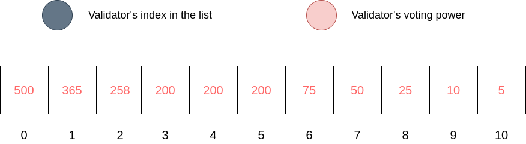
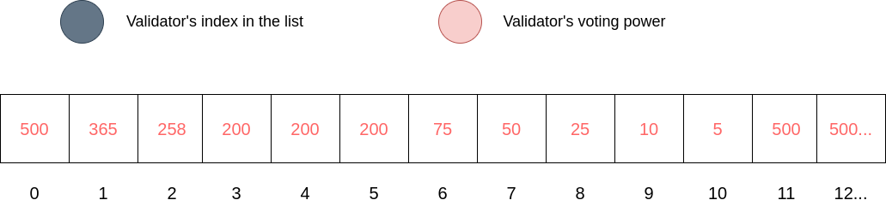

### Requirements of the algorithm

The validator selection algorithm should have three main characteristics stated below in order to provide a fair and fast system for all validators participating in the network:

1. All validators should have a chance to execute an AI request regardless of their ranks. This is the most important requirement, as we do not want big validator companies with high stakes to entirely dominate the network. 

2. The percentage of being picked for executing an AI request should be based on the amount of ORAI tokens staked (voting power). This allows validators to dedicate themselves to execute the request correctly to earn more stakes and trust, which help them climb the ranks. The delegators also know which validator has more potentials to deliver rewards through the voting powers.

3. The algorithm should not be too complicated. This is also quite crucial because it is run everytime there is a request from the users. If it takes too many resources or time to sample a list of validators, the traffic may increase, which reduces the number of requests per second as well as the QoS.

### Validator duplication

The validators are chosen randomly based on their voting powers. Indeed, all the bonded validators are sorted and put in a ```list```, where the first element is the highest-staked validator, while the last element contains the lowest-staked one. In each AI request, the system updates this ```list``` since there may be an update in the validator set, or the voting powers have been changed. Within the ```list```, each validator is duplicated n - i - 1 times, with i is the index of the ```list```'s element, and n is the length of the list. This helps increase the chances of getting chosen for those validators with high voting powers, while validators in the lower ranks also can participate in the AI request flow. Note that if the voting powers of two validators are equal, both will be duplicated with the same number.

#### Initial bonded validator list diagram



The diagram shows an example of a bonded validator ```list``` with each index value is the validator's voting power. In the system, the value is actually a Validator struct to hold more information needed.

For the first index, the validator is duplicated 10 - 0 - 1 = 9 times since it is in the top rank. It is similar for the 2nd and 3rd validator. However, there are three validators having the same voting power value, which makes them equal in ranks despite having different indexes. Consequently, these validators will be duplicated based on the first encounter of this voting power. In this example, the number of duplication is 10 - 2 - 1 = 7 times which applies to three validators in the index 2, 3, 4 respectively. 

The algorithm continues with the 6th validator being copied 10 - 6 - 1 = 3 times and so on until we reach the final index of the ```list```.

#### Validator duplication diagram



The diagram demonstrates the list after the duplication step, where three dots means that the list can be longer than that. 

### Validator sampling

The system generated a random integer with the range of [0, ```list_length```). The reason we use ```list_length``` as the maximum value for this random integer is that we want to choose a number within the ```list``` range. As a result, we can collect a random validator that is based on its voting power. More integers are generated until it reaches the total number of validators provided by the user. Oraichain does not store this ```list```, so it does not consume any additional gas.

<!-- ---
id: DecentralizedValidatorSampling
title: Decentralized Validator Sampling

---

The validators are chosen in turns based on their voting powers. Each validator has a turn point, which is increased after every newly committed block. A validator with a high voting power will have its point increased faster than other validators with lower voting powers. As a result, validators with a large amount of stakes will have more turns of running oracle scripts and collecting rewards. The top k-validators that has the highest turn points with k is the number of validators given by users will execute the oracle scripts before reseting those points to zero.

However, there is a maximum value of how fast the turn point can increase after each successful block. This prevents large staked validators to entirely dominate the queue and give validators with low tokens staked a better chance to execute the scripts. -->