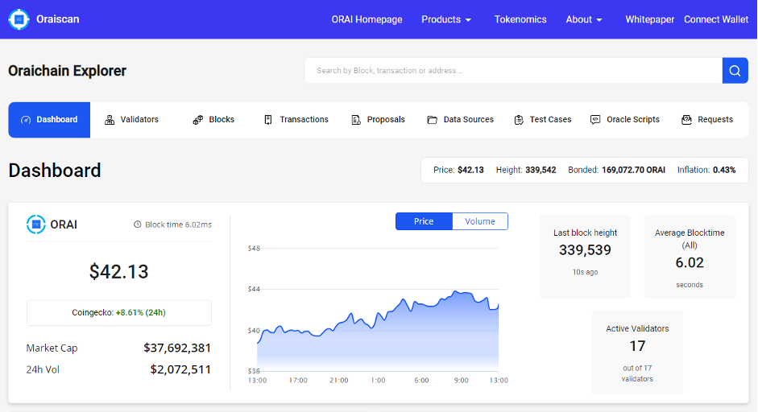
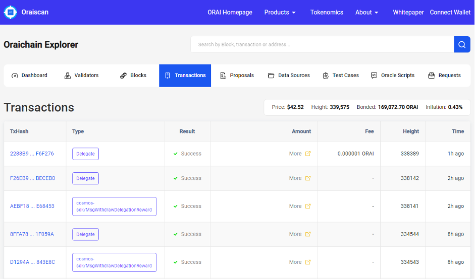
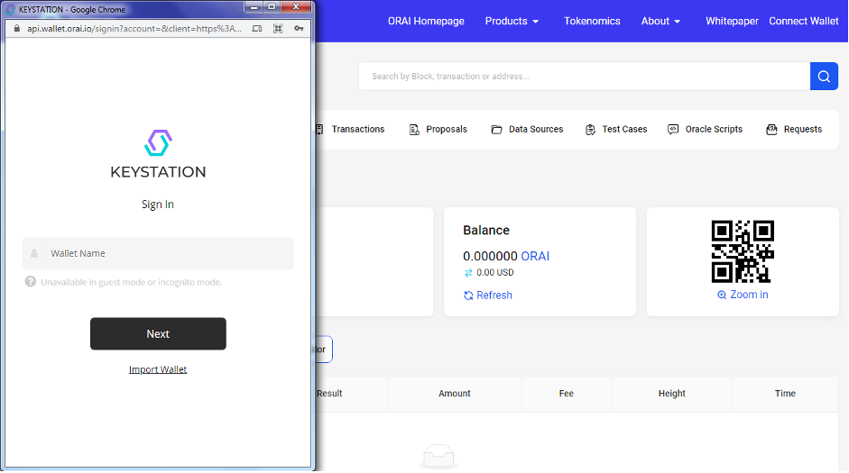
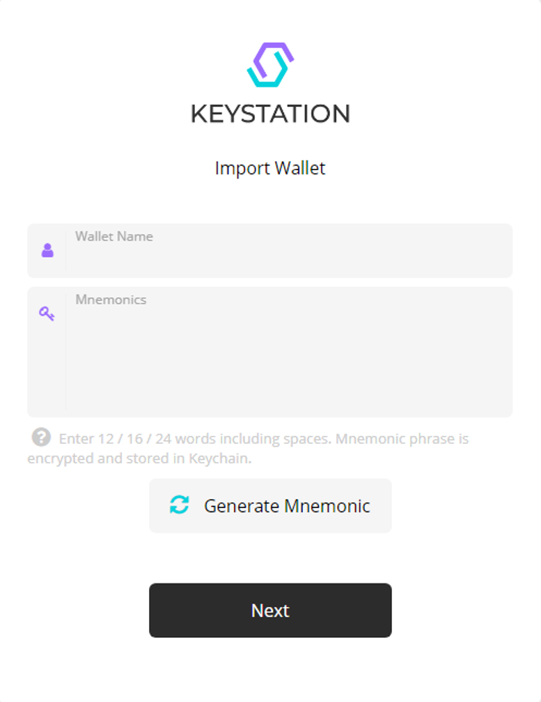
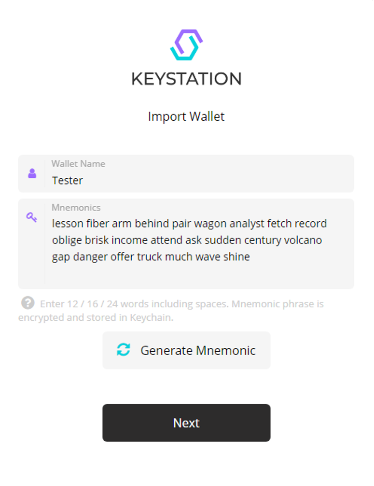
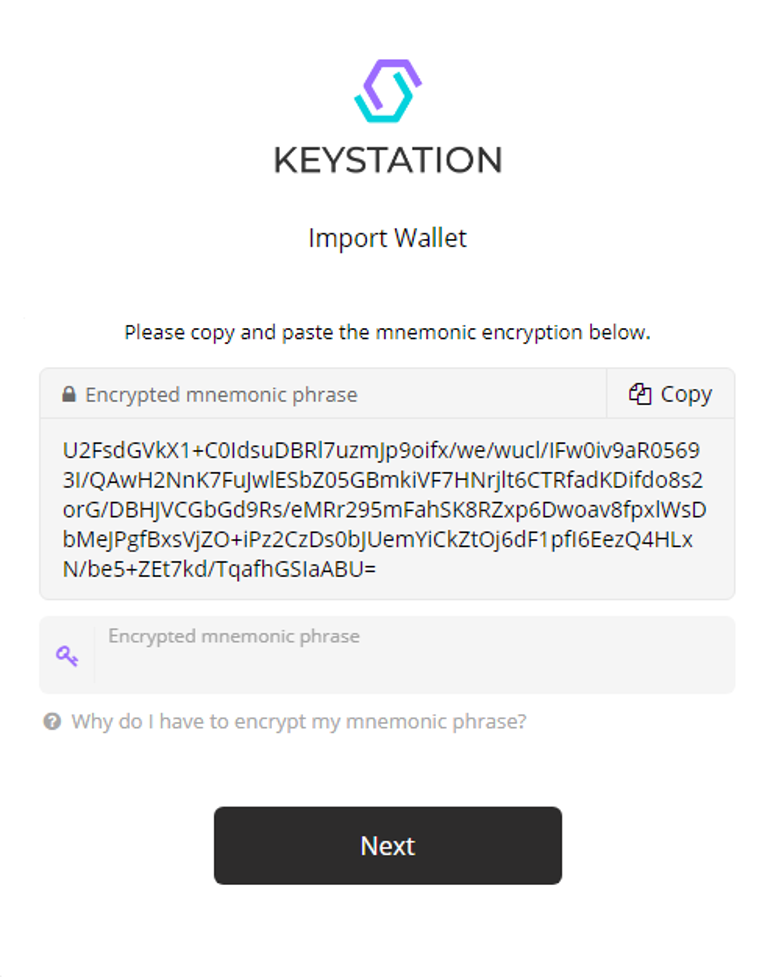

## Create An Oraichain Account

In order to bridge the Oraichain Network, validators and users, Oraichain has introduced **Oraiscan** (aka. **Oraichain Explorer**) and **ORAI Wallet**.

In a nutshell, Oraiscan serves as the main portal that shows all activities happening on the Oraichain Network, including basic functionalities such as **Transactions**, **Blocks**, a **Validators** list along with cutting-edge AI-powered features such as **Data Sources** from AI providers, **Test Cases** (from testcase providers), **Oracle Scripts** (execution templates), and **Requests**.

To notch up the full user experience on **Oraiscan**, you need to create an Oraichain account. Below is the thoroughgoing process of doing so:

**Step 1:** Visit **https://scan.orai.io/**

**Step 2:** Click on **Connect Wallet** and you’ll see a **KeyStation** pop-up window.

**Step 3:** Choose **Import Wallet** to create a new account.

**Step 4:** Type in your own **Wallet Name**, then click **Generate Mnemonic**

The then-generated mnemonic phrase acts as a private key for your wallet, so you should keep it secure with a notepaper and/or a soft copy for later use.

**Step 5:** Click **Next** to set up a PIN password and confirm it once again. You must remember the password - if not, you’ll never be able to recover your account.

**Step 6:** Lastly, you’ll be redirected to an **Encrypted Mnemonic Phrase**. Just copy and paste it underneath, and then hit **Connect**.

Congratulations, now you’re good to flick through **Oraiscan**!
