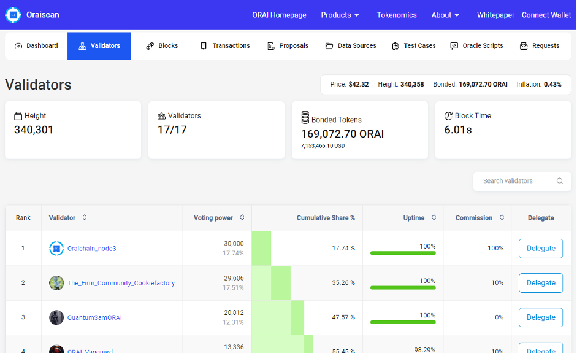
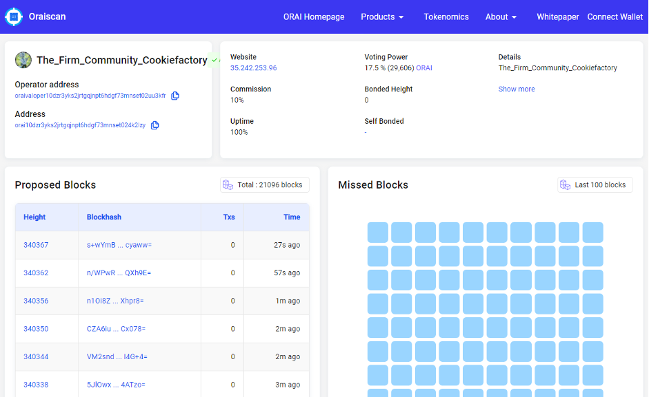
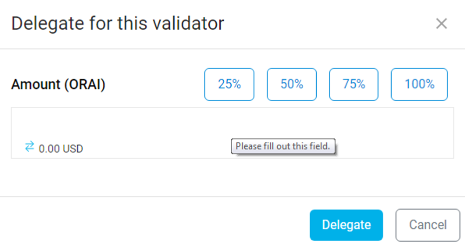
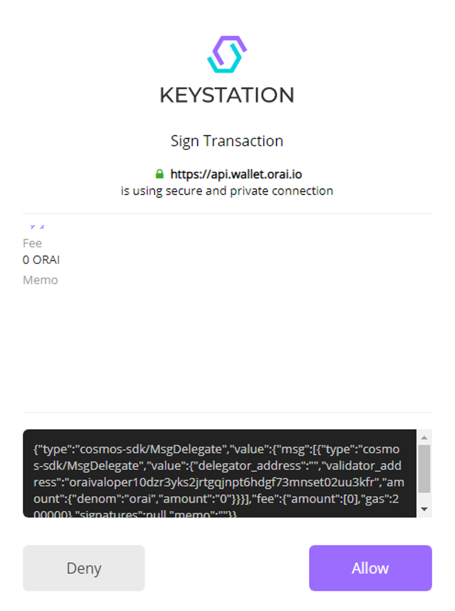
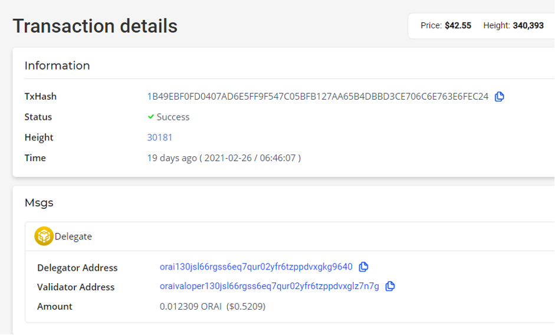

---

id: delegate-tokens-to-a-validator
title: Delegate Tokens To A Validator

---

## Delegate Tokens To A Validator

In the view of Oraichain’s **Delegated Proof-of-Stake (DPoS)** consensus protocol, the network will consist of numerous validators that require ORAI tokens to run nodes, while other ORAI token holders can be delegators by staking their tokens to validators and get shared rewards for each newly created block.

Over the course of using **Oraiscan**, ORAI token holders can start delegating ORAI tokens to any qualified validators on the Oraichain Network.

**Reminder:** Prior to the delegation, make sure that you’ve already got an Oraichain account on Oraiscan as well as sufficient ORAI tokens.

**Step 1:** Visit **https://scan.orai.io/** and log into your account via **Connect Wallet**.

**Step 2:** Navigate to the **Validator** section, in which you can see a list of validators assigned by Oraichain.

**Step 3:** By clicking on the name of a validator, you can check out some technical details such as commission rate, uptime, etc.

**Step 4:** Go back to the validator list and choose **Delegate**.

**Step 5:** Enter a certain number of ORAI tokens and confirm your delegation.

**Step 6:** A prompt of KeyStation will pop up on the screen > Click **Allow** to **Sign Transaction**, then enter your **PIN**.

Once done, you’ll be redirected to the **Transaction Details** - for example:

