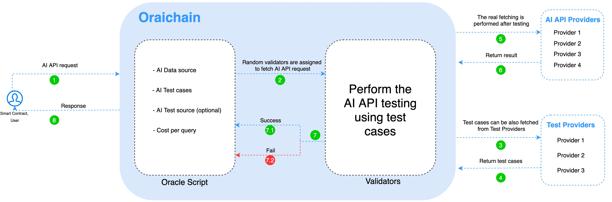

Oraichain is a public blockchain that allows users to create different data requests. Instead of users, smart contracts can also request data securely from AI APIs through Oraichain. The blockchain network is built based on [Cosmos SDK](https://cosmos.network/) along with [Terdemint](https://tendermint.com/)’s [Byzantine Fault Tolerance](https://en.wikipedia.org/wiki/Byzantine_fault) consensus that helps speed up transactions’ confirmation time.

## Network Participants
### Validators
The ORAI consensus protocol is similar to the delegated proof-of-stake (DPoS). Indeed, the network consists of numerous validators, each owning ORAI tokens while other ORAI token holders can be delegators staking their tokens to validators and get rewards for each newly created block.

The second task of the validators is to collect data from AI providers and validate that data before they are written to the blockchain. To validate an AI API, validators will do testing based on the test cases given by users, smart contracts, and test providers. If users do not know which test case is good, they can request some test cases from test providers.

### AI providers

### Testcase Providers

## System Architecture

The flow of requesting an AI API is illustrated in the Oraichain’s System Overview figure. To perform a request, users or smart contracts need to call an oracle script that is available on the ORAI gateway or marketplace. In an oracle script, there are AI data sources (provided by AI providers), test cases, test source (optional), and transaction fees for each request. When a request comes, a random willing validator is chosen to perform this request. The chosen validator will fetch data from one or more AI providers on behalf of the user after executing the test scenarios, and if the AI provider fails in testing, the request is canceled.

A request is successful if its result is written to the Oraichain blockchain. The transaction result, which can be fetched from smart contracts and regular applications, is proof of execution, and fees are applied in this transaction. There is an overhead of reading results from Oraichain’s transactions, but it helps ensure that the AI API quality is good and there is no data tampering during the process of fetching data from AI providers.

Compared to Band Protocol and Chainlink, API testing based test cases is the unique functionality. Since Oraichain focuses on AI APIs, testing is very important to control the quality of AI providers. Besides, test providers can propose suitable test cases that users can choose to test an AI API. Test cases in the Oraichain marketplace can encourage AI providers to improve the accuracy of AI models.

Another interesting feature is that the Oraichain community has the power to rate the validators’ reputation for quality AI APIs improvement. If a validator has bad behavior, such as failing to perform test cases and validate AI providers, slow response time, and low availability, its holding token will be slashed.

Nevertheless, validators in Oraichain is responsible for performing many important tasks and could be a centralized point. Therefore, the number of chosen validators should be high in order to increase request performance, scalability, and high availability. Meanwhile, because we need many validators to participate in the Oraichain network and maintain their quality work, block reward and transaction fees must be applied for such validators to earn more ORAI tokens.
