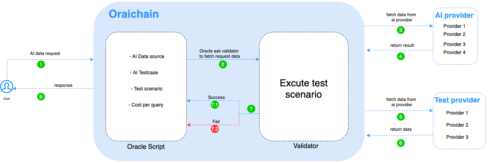

## System Overview

Oraichain là một mạng blockchain công khai cho phép mọi người có thể tạo một yêu cầu về dữ liệu. Đặc biệt Oraichain giúp việc yêu cầu dữ liệu có thể thực hiện được từ các smart contract. Dự án được xây dựng dựa trên [Cosmos SDK](https://cosmos.network/)  và sử dụng thuật toán đồng thuận [Terdemint](https://tendermint.com/)'s [Byzantine Fault Tolerance](https://en.wikipedia.org/wiki/Byzantine_fault) để đạt được trạng thái cuối cùng một cách ngay lập tức.

### Network Participants

Oraichain's network consists of a number of network participants, each owning ORAI tokens.

#### Validator 

Validators are responsible for performing two main functions on the network. First, they are responsible for proposing and committing new blocks in the blockchain. They participate in the block consensus protocol by broadcasting votes which contain cryptographic signatures signed by each validator's private key. This is similar to most other Cosmos-based delegated proof-of-stake blockchains.

Each validator will have a certain amount of ORAI tokens bonded to them. The source of these tokens can either be their own holdings, or the tokens delegated to them by other token owners. In most cases, there will be a large number of parties with tokens staked to them. In that case, the top `NNNNNNN` validator candidates with the most token staked to them will become Oraichain's validators.

The role the validators described above is similar to those of validators on many other Cosmos-based blockchains. In addition, most transactions supported by Oraichain (asset transfer, staking, slashing, etc.) are also derived from Cosmos-SDK. 

Điểm chính tạo nên sự khác biệt cho Oraichain nằm ở nhiệm vụ thứ 2 của validator. Nhiệm vụ thứ 2 của validator trong mạng Oraichain là xác thực các dữ liệu AI từ ngoài và đưa vào mạng blockchain. 

Flow request AI data.

