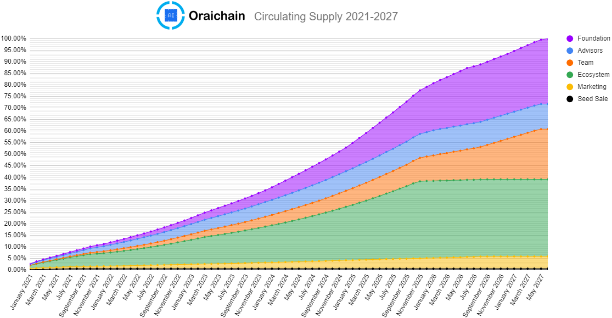

When we call **ORAI**, it means that it is native ORAI tokens created and contained in the Oraichain network. At the beginning, we are basing on ERC20 to issue ORAI token on the Ethereum network that we call **ERC20-ORAI**.

## Key metrics
| Token Name                 | ORAI                          |
|----------------------------|-------------------------------|
| Token Type                 | ERC20 (and native after mainnet launch)                      |
|**Seed Sale Round**||
| Amount Expected Seed Sale    | $70,000                       |
| Seed Sale Token Price      | Each ERC20-ORAI = $0.081       |
| Seed Sale Allocation       | 860,000 ERC20-ORAI (1.00%)           |
| Seed Sale Date             | 25th~30th September 2020      |
| Locked time                | 0.25% unlocked, 0.75% locked until public sale      |
|**Private Sale Round**||
| Amount Expected Private Sale | $3,000,000                    |
| Private Sale Token Price   | Each ERC20-ORAI ~= $0.3         |
| Private Sale Allocation    | 10,000,000 ERC20-ORAI (11.63%)  |
| Private Sale Date          | October to December 2020     |
| Locked time                | 5.82% locked until mainnet launch, 5.82% locked over one year      |
|**Public Sale Round**||
| Public Sale Token Price       | TBD                           |
| Public Sale Allocation | 11,180,000 ERC20-ORAI (13.00%)         |
| Public Sale Date        | January 2021             |
| Initial Circulating Supply | 215,000 (0.25%)           |
| Total Token Supply         | 86,000,000 ERC20-ORAI               |

## ORAI token distribution (%)
**The token supply distribution is as follows:**
- Seed Sale Investors comprise 1.00% of the total token supply.
- Private Sale Investors comprise 11.63% of the total token supply.
- Public Sale Investors comprise 13.00% of the total token supply.
- Ecosystem comprises 30.00% of the total token supply.
- Team comprises 17.37% of the total token supply.
- Advisors comprise 7.00% of the total token supply.
- Foundation comprises 20.00% of the total token supply.

Foundation tokens are used to fund critical development of Oraichain-related technologies and provide financial support to projects and entities within the Oraichain community, in order to accelerate the growth of the ecosystem.
Ecosystem tokens will be incentives for Validators, AI Providers, and Testcase Providers.

**ORAI token release schedule (%)**

All team, advisors, and private sale investors' tokens are locked at least after the mainnet launch.
Therefore, no founders, team members, advisors, or investors in the private sale round will be able to sell ERC20-ORAI tokens on any secondary market at the time of listing or any time prior to the mainnet launch.
We think it is very important to set up the incentives properly for our team and early supporters in the seed sale round.
- 75% of seed sale tokens are locked until public sale.
- 50% of private sale tokens are locked for 1 year.
- 50% of team tokens are locked in 5 years.
- 30% of advisor tokens are locked in 5 years.

## Token governance and use of funds
Funds raised in the seed and private rounds will be spent according to the following allocations:
- 60% technical and business development
- 20% marketing
- 10% operation
- 10% legal and audit fee

Funds are raised in ETH or fiat and then they are converted to stable coins in order to avoid crypto price’s volatility risk. ETH and stable coins are store in multi-signature wallets that require at least 3 out of 4 signatures from Oraichain founders.

## ORAI token utility
When ORAI mainnet is officially launched, the ORAI token is required to secure and power the decentralized oracle network of validators. The native ORAI token is used in different scenarios below:
- Staking for validators: all validators are required to stake ORAI in order to be selected to create a block or fulfill data requests.
- Transaction fee: the ORAI token is required in order to run an AI request sent to the Oraichain network.
- Participation in Oraichain Governance: the Oraichain network is organized in the DAO manner, all protocol upgrades and parameter changes must be voted by token holders.

### Transaction fee
The token plays a role as transaction fee that is paid for parties as follows:
- Request-executing validators
- AI-API providers
- Testcase providers
- Block-creating validators.

The transaction fee is different depending on the fee requirement of request-executing validators, AI-API providers, and test-case providers. The transaction fee should be explicitly defined in MsgSetAIRequest of a request. When a request comes, request-executing validators must decide if they want to execute it. After that, a random validator, which is responsible for proposing a block, is chosen from the willing request-executing validators. The chosen validator will execute the oracle script before firing an event to those request-executing validators.

After that, these validators interact with test cases and AI APIs to create a MsgResultReport in the end. A report contains information on the validator that created it, the data sources, test cases used, and the block containing that report transaction. Using this information, we can collect validators, test case owners, and data source owners involved in a specific block to reward them. Only those creating reports are able to receive the rewards. If there is more than one validator asked in the MsgSetAIRequest (AskCount), the transaction fee is divided proportionally to the voting power of each validator.

### How ORAI token is mined
There are two ways for miners to mine ORAI tokens. The first way is that the ORAI token is rewarded for each newly created block. The number of rewarded ORAI tokens will be decided later before the mainnet launch. In the Oraichain network, validators are responsible for creating new blocks and a random validator is chosen to do that. In order to become a validator, one needs enough ORAI tokens that are staked or delegated. Note that new ORAI tokens are only mined when a block contains one or more transactions with transaction fees. Such fees will be converted into tokens in the form of rewards for the validators.

The second way is briefly described above, in which the request-executing validators can earn some extra ORAI tokens by executing test cases and data sources. Similar to the first way, 60% of the total transaction fee is extracted as a reward for the first three parties mentioned earlier. The remaining 40% is saved to reward validators for the newly committed block. Nevertheless, this second way only occurs when there is at least a MsgResultReport broadcast to the Oraichain network at the end of a block.

### ERC20-ORAI token and ORAI token (native)
There is a mechanism to synchronize ORAI tokens on the Oraichain network and ERC20-ORAI tokens on the Ethereum network. We will announce a conversion bridge later before the mainnet launch.

### Inflation, staking, and slashing
In order to keep the value of ORAI token, holders must stake their token to the Oraichain network. The rewarding token is divided based on the number of tokens that a holder is staking to a validator.

Slashing is a mechanism to punish bad behavior of validators in aspects of AI API quality, response time, and availability.
