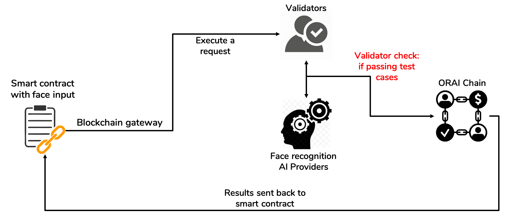

AI will be the next big thing and upgrade of smart contracts in DApps. How to make smart contracts smarter with AI. We would like to introduce several use cases where smart contracts can leverage AI.

Oraichain also supports regular centralized applications in using AI APIs on the decentralized Oraichain marketplace. Users can find better AI providers with better price in this marketplace.

## Yield farming using AI services on Oraichain (yAI)
MVP version: https://yield.orai.io

The yield farming based on Oraichain (namely yAI) has got inspiration from yearn.finance (YFI) that helps reduce the complexity of yield trading and provides trading strategies from crowdsourcing DAO voting. Instead of using crowdsourcing knowledge, Oraichain provides AI-based price prediction APIs as inputs to smart contracts. The yield farming use case has two functionalities as follows:
- Earn: Get price prediction from Oraichain and automatically decide BUY/SELL tokens. You can choose the best performance AI APIs.
- Vaults: Apply automated trading oracle scripts on Oraichain. You deposit tokens and the assigned oracle script will find the best AI input and maximize your yield.

Compared to yearn.finance (crowdsourcing-based strategies), AI-based trading performance could be less efficient, but risk management could be better since all buying or selling decision is based on AI models (or by machine) and not by human psychology.
Moreover, yAI is based on data-driven information fetching from Oraichain in order to provide automated trading smart contracts.

Our current design of yAI (MVP) is getting trading signals (e.g. market sentiment, support and resistance) from outside and doing optimized trading like YFI. But yAI is not based on community-based trading strategies.

## Flexible smart contracts using face authentication
There are several scenarios in which face authentication is very useful as follows:
- Using your face to get your balance instead of using a private key.
- Withdraw using your face
- Using your face in order to reset your private/public key pair.
- Using both your private key and face in order to execute a smart contract.

Using face authentication might be riskier than a private key, but it helps increase user experience. In cases of checking balance and withdrawing tokens to registered wallets, face authenticatiion is safe and convenient.

## Fake news detection using different AI providers from Oraichain
This use case focuses more on a regular application that wants to check if the news can be trusted. Oraichain provides a marketplace in a decentralized manner in which combining results from different providers is possible. If the providers want to receive payments, their APIs must pass the test cases, which is when the APIs return the correct results of your own test cases.

## More other use cases is coming soon
- Smart contracts help check if a product is fake in the supply chain.
- Smart contracts deciding a loan based on users’ credit score.
- Smart contracts automatically pricing game items based on their characteristics and DNA.
- Marketplace of automated diagnostics for X-ray images, spam classification, handwriting detection using OCR, and citizen ID card detection using OCR.
